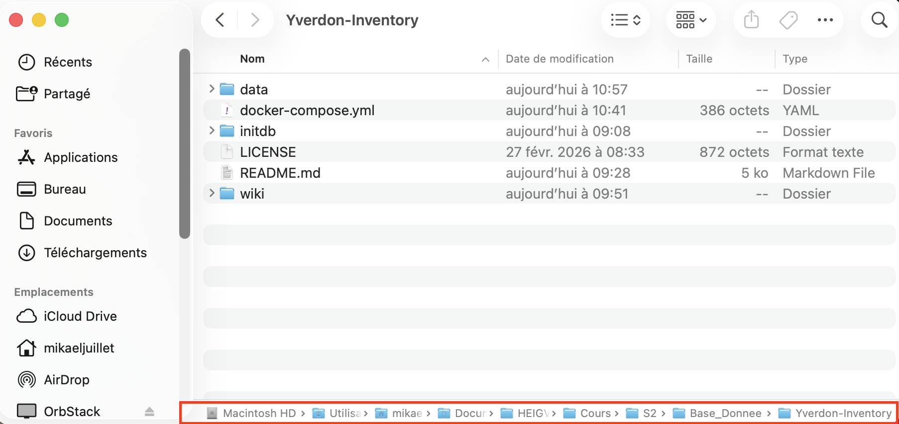
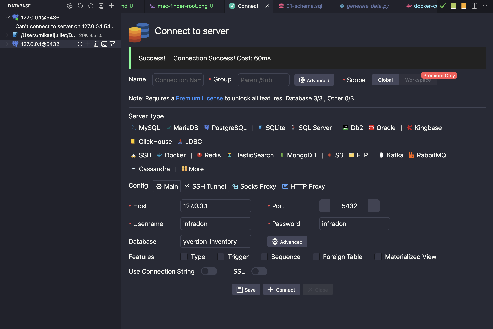
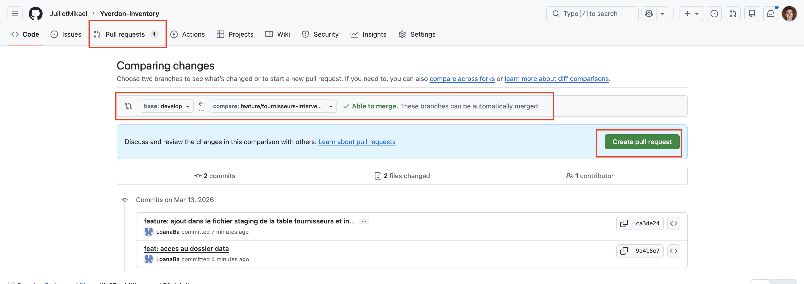
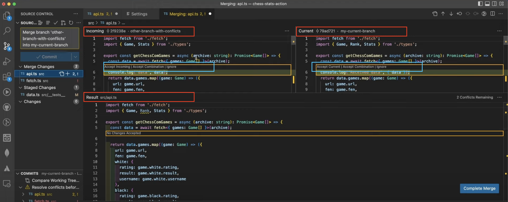

# Se placer dans le bon dossier
Ouvrez votre gestionnaire de fichiers et allez dans le dossier yverdon-inventory. 

Sur Windows : 
- faire un click droit -> ouvrir dans le terminal
- Ouvrir WSL 
```shell
wsl
```
Tu est dans wsl pour la majorité des commandes et principalement GIT. 

Si tu dois run docker, tu peux faire un exit, puis revenir sur wsl.

- Quitter WSL
```shell
exit
```

Sur mac : 
- fait "command" + "option" + "P" avec le clavier 

Tu devrais voir une barre en bas du finder : 


- Fait click droit sur le dernier dossier
- Puis ouvrir dans le terminal

# Git
On travaille sur la branche develop.
- `main` : code prêt pour la production
- `develop` : branche de développement principale
- `feature/*` : nouvelles fonctionnalités

## Mode classique 

1. se déplacer sur develop
```shell
git checkout develop
```

2. pull pour être sûr que tu as la dernière version
```shell
git pull
```

### Créer une branche
Quand tu dois ajouter une fonctionnalité.
```shell
git checkout -b feature/nom-de-la-feature
```

Ensuite tu peux modifier le code que tu veux. 

### Ajouter des modifications 

Ajouter un fichier précis
```shell
git add dossier/fichier
```

Ajouter un dossier entier
```shell
git add dossier/
```

Tout ajouter
```shell
git add .
```

Créer un message définissant vos modifications avec un type de modification (voir exemple).

```shell
git commit -m "type: mon messsage"
```

Exemples : 
```
git commit -m "feat: add login functionality"
```
```
git commit -m "docs: update API documentation"
```
Types :
- `feat` : nouvelle fonctionnalité
- `fix` : correction de bug
- `docs` : modifications de la documentation
- `style` : modifications du style du code (formatage, etc.)
- `refactor` : refactorisation du code
- `test` : ajout ou modification de tests
- `chore` : tâches de maintenance

Une fois, tout ajouter, push les ficher. 
```shell
git push
```

Si vous avez un message comme ça : 
```shell
fatal: The current branch feature/doc has no upstream branch.
To push the current branch and set the remote as upstream, use

    git push --set-upstream origin feature/doc

To have this happen automatically for branches without a tracking
upstream, see 'push.autoSetupRemote' in 'git help config'.
```
C'est normal, c'est que la branche n'existe pas à distance, il suffit de faire. 

```shell
git push --set-upstream origin feature/doc
```


# Lancer le projet
Une fois que vous êtes sur la bonne branche, vous pouvez démarrer le serveur.

## docker
1. Lancer votre application docker desktop.

Lancez le docker : 

```shell
docker compose up -d
```

Éteindre 
```shell
docker compose down
```


Éteindre et SUPPRIMER les fichiers
```shell
docker compose down -v
```

# Paramétrer VS-Code

Ajouter la base de données comme suer l'image : 



# Merge
1. Créer une pull Request mais ne pas la valider avant que quelqu'un d'autre ne la valide.

Mettre les bonne branches 
- La branche visée/base (develop)
- La branche de départ/compare = votre branche



## Gérer les conflits
Si un message apparait comme quoi vous avez des conflits. 

Pour les régler dans vs-code suivez le guide suivant : 

Aller dans la branch que l'on vise (develop)
```shell
git checkout develop
```

pull les nouvelles modifications
```shell
git pull
```

retourner dans la branche
```shell
git checkout feature/branche
```

Pour voir les branches : 
```shell
git branch --all
```

Merge develop dans la branche: 
```shell
git merge develop
```

À partir de là, si vous voulez annuler le merge : 
```shell
git merge --abort
```

Pour résoudre le merge il faut : 

Ouvrir le fichier qui pose problème, il est en rouge ou brun dans l'IDE. 


En bas, à droite, cliquez sur "resolve conflict" 

Vous devriez voir 3 écrans qui contiennent :
- En haut à gauche : le code dans la branche que vous voulez merge.
- En haut à droite : le code de votre branche
- En bas : le mélange des deux

En haut en rouge, vous voyez une mention de la branche. 
En jaune c'est les différences entre les fichiers.
En bleu c'est les actions que vous pouvez faire (accepter celui-là, accepter les deux ou aucun).



Une fois résolue, vous pouvez valider. 

Commit et push vos modifications.
